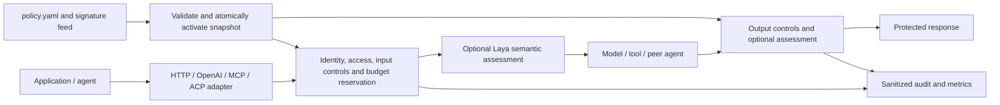

# 2. Architecture and performance — 20%

FastFence applies centrally configured policy locally, around model and tool interactions. Its protocol adapters share the same control runtime.

**Request path:** local deterministic checks precede configured inference. Bounded admission queues absorb bursts up to their configured capacity and timeout. Each admitted request uses validated configuration; queued requests recheck current policy. Invalid updates leave the last valid snapshot active. Output enforcement follows upstream execution and cannot undo an external tool's side effects.

**Storage:** policies, counters, reservations and audit are in process memory; configuration and keys are local files. No database or Redis is required on the request path. Restart clears budgets/audit; independent processes do not share quotas. Stateless reversible text tokens carry encrypted values rather than referencing a conversation database.

## Measured enforcement latency

Historical **public PyPI 1.0.2**, Apple M3 Pro, macOS arm64, Python 3.12.12, concurrency one. Direct Python calls, no ingress HTTP and no business-model generation. The OFF baseline bypasses the engine and calls the constant fixture; ON includes enforcement, budget and audit work.

| Mode | p50 | p95 | p99 | Measured samples |
|---|---:|---:|---:|---:|
| OFF: direct constant fixture | 0.000125 ms | 0.000167 ms | 0.000208 ms | 2,000 + 100 excluded warmups |
| Deterministic ON | 0.206125 ms | 0.2475 ms | 0.64375 ms | 2,000 + 100 excluded warmups |
| Semantic ON: actual Laya / Qwen3:4b | 1,117.160333 ms | 1,199.532 ms | 1,222.1415 ms | 20 + 2 excluded warmups |

Sources: [OFF/deterministic report](../evaluation/results/installed-package-1.0.2-comparison.json), [semantic report](../evaluation/results/installed-package-1.0.2-semantic.json). Fixed benign input and warmed model; the small semantic sample is not an accuracy evaluation or production latency guarantee. These timings must not be attributed to 1.0.7.

## Release 1.0.7 queue verification

| Check | Outcome | Scope |
|---|---|---|
| Controlled burst | 1,000/1,000 completed; 8 active, 992 waiting | Synthetic provider; no model inference |
| Actual model workload | 12/12 completed; 2 admitted, 10 waited; 24 semantic assessments | Candidate wheel outside checkout; Laya/Qwen3:4b and Qwen3:0.6b |

[Recorded queue results](../evaluation/results/request-queue-1.0.7.json). The real run took 17.775 seconds overall, with a maximum observed wait of 15.671 seconds. This verifies queue behavior, not capacity for 1,000 simultaneous model conversations. All final active/waiting/inflight counters were zero.

## Review and reproduce

- [Exactly ten slides](../presentation/output/fastfence-submission.pdf): editable architecture in the companion PPTX and scoped benchmark table.
- [Three-minute demonstration](../presentation/output/fastfence-submission.mp4): actual hot reload, protocol calls, privacy and OCR.
- [Test commands and evidence](../4-testing/README.md).
- [Deployment and adapters](../5-implementation/README.md).
- [Source architecture](../src/fastfence/): `app`, `workflows`, `modules`, `shared`, with enforced import boundaries.
