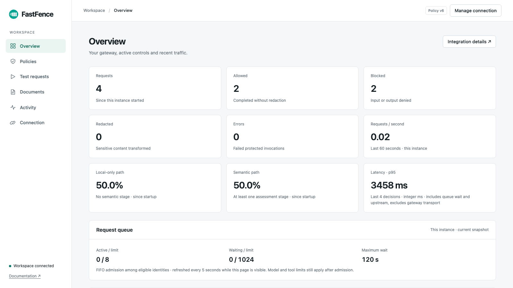
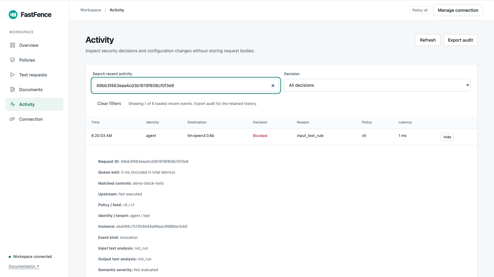

# 3. Security reporting — 20%

FastFence connects each security decision to its policy version, matched controls, execution boundary and resource usage. The dashboard and JSONL export use the same bounded, process-local audit ledger.

**Review first:** [dashboard](dashboard.png), [expanded audit event](audit.png), [metric definitions](METRICS.md), [three-minute recorded demonstration](../presentation/output/fastfence-submission.mp4).



This is an unmodified capture of public FastFence **1.0.7** from the isolated policy demonstration. The four recorded invocations produced two allowed and two blocked decisions. These are demonstration counts, not throughput or business-impact measurements. The later OCR and protocol demonstrations use separate instances. [Recording evidence](../presentation/output/demo-evidence.json) explains those boundaries; [image provenance](assets-provenance.json) records the original files and unchanged-copy provenance.

## Open and inspect

1. In your installation directory, run `uv tool run fastfence`. The first launch needs uv and a running Ollama service; it prepares the configured models and required local components. See the [installation guide](../docs/getting-started.md).
2. Open **http://127.0.0.1:8000**. In **Connection**, use the `local-agent` and `local-admin` entries from your private `state/credentials.json`. The agent token sends calls; the management token reads reporting and changes policies. Dashboard tokens stay in page memory.
3. Open **Overview** for counts, path shares, latency, request queue, recent denial reasons and resource usage. Data refreshes every **five seconds while the browser tab is visible**. Use **Refresh** in **Activity** for an immediate read.
4. In **Test requests**, send a protected call. Inspect its decision and **Upstream: Executed / Not executed**, then select **Inspect in Activity**. HTTP success alone is not a security verdict: the native REST endpoint can return a blocked verdict in an HTTP 200 response.
5. In **Activity**, search by request ID, identity, tenant, destination, reason, rule finding or policy version. Filter by decision and expand **Details**. **Export audit** downloads `fastfence-audit.jsonl`.

The screen shows a recent snapshot, not a push-streamed global monitoring service. Counters are updated as invocations finish; the browser polls them. A failed refresh reports that displayed data may be stale.



## What the report explains

| Question | Evidence exposed |
|---|---|
| Why was this interaction stopped? | `decision`, `reason`, matched `findings`, policy and feed versions. |
| Did the model or tool already execute? | `upstream_executed`. An output block can happen **after** execution; an input block can prevent execution. |
| Did semantic checks actually run? | Separate input/output statuses: `not_run`, `passed`, `blocked`, `error`. A configured provider alone is not evidence of a completed assessment. |
| Was the request waiting or working? | `queue_wait_ms` separately from total `latency_ms`; queue occupancy and capacity in status. Waiting is included in total latency but excluded from accounted compute time. |
| Which identity used the budget? | UTC-day budget rows for the trusted subject, effective role-derived limits, reserved/settled token units, estimated cost and compute usage. |
| Was sensitive output transformed or restored? | `anonymized` and `restored`, plus privacy findings. The audit omits the response payload. |
| Can the decision be correlated? | Request ID, instance ID, sequence, timestamp, subject, tenant and target. |

See [METRICS.md](METRICS.md) for counter units, windows, limitations and exact source definitions.

## Export through the API

Both endpoints require a management bearer credential:

| Method / path | Result |
|---|---|
| `GET /api/admin/status` | Active policy/feed, metrics, budgets, recent audit events, runtime/configuration diagnostics, queue snapshot and connected tool information. |
| `GET /api/admin/audit.jsonl` | `application/x-ndjson` attachment; retained events in chronological order, capped at the most recent **10,000** exported events. |

Run this from the installation directory to export without copying a credential into a command or printing it:

```bash
uv run --no-project --python 3.12 python - <<'PY'
import json
from pathlib import Path
from urllib.request import Request, urlopen

credentials = json.loads(Path("state/credentials.json").read_text())
request = Request(
    "http://127.0.0.1:8000/api/admin/audit.jsonl",
    headers={"Authorization": "Bearer " + credentials["local-admin"]},
)
with urlopen(request, timeout=10) as response:
    content = response.read()
Path("fastfence-audit.jsonl").write_bytes(content)
print("Saved fastfence-audit.jsonl")
PY
```

Use the credential key configured for your installation if it differs. Exported logs contain identity and routing metadata, so share them according to your own data-handling policy. They do not include raw prompts, tool arguments, model response payloads, bearer credentials or private cryptographic keys. Audit findings identify controls rather than reproducing matched sensitive text. Structured rule names, identity labels and destinations remain metadata and should be named accordingly.

## Concrete recorded correlation examples

The [real OpenAI SDK report](../presentation/output/integration-demo-evidence.json) records this pair in one isolated public-package gateway:

| Request ID | Outcome | Policy | Execution |
|---|---|---|---|
| `437395f83929488ab6c4087312e2da8b` | `allowed`, HTTP 200; both semantic stages passed | v1 | `upstream_executed=true` |
| `6e7a1f8912cd4da1a462842129769fc8` | `blocked`, `input_text_rule`, HTTP 403 | v2 | `upstream_executed=false` |

The same SDK payload was retried after an explicit policy change. These historical IDs belong to the stopped demonstration instance; they are not expected in a newly launched gateway. The screenshot above belongs to the separate dashboard recording, whose versions are v4–v6. No global audit history is implied.

Additional recorded boundaries: [MCP tool execution count remains 1 after the block](../presentation/output/mcp-demo-evidence.json), [ACP peer execution count remains 1](../presentation/output/acp-demo-evidence.json), [actual OCR privacy findings and model-stage outcomes](../presentation/output/ocr-demo-evidence.json), [authorized restoration and denied restoration](../presentation/output/anonymization-demo-evidence.json).

## Implementation and verification references

- [HTTP routes and management authentication](../src/fastfence/app/interfaces/http/routes.py): dashboard, status and JSONL export.
- [Ledger](../src/fastfence/modules/control/persistence/ledger.py): bounded audit retention, event counters, rolling throughput and latency samples.
- [Status assembly](../src/fastfence/modules/control/application/use_cases/management.py) and [runtime facade](../src/fastfence/modules/control/application/facade.py): current policy, budgets, queue and tools.
- [Dashboard rendering and refresh](../src/fastfence/app/interfaces/http/web/console.js), [Activity details and filters](../src/fastfence/app/interfaces/http/web/audit.js).
- [Request-path metric tests](../tests/unit/test_request_path_metrics.py), [management/invocation classification tests](../tests/unit/test_telemetry_classification.py), [audit-export integration assertions](../tests/integration/test_gateway.py), [OpenAI privacy assertions](../tests/integration/test_openai_privacy.py), [asymmetric-restoration audit assertions](../tests/integration/test_asymmetric_anonymization.py).

This category provides traceable product evidence, not a self-awarded jury score. Storage is deliberately in memory: restart clears counters and audit, and multiple instances do not share a global budget or audit history.
