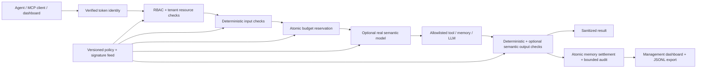

# FastFence

**Fast agents. Clear boundaries.** A working AI Control Layer for HackYeah 2026 / Goldman Sachs.

Licensed under the [Apache License 2.0](LICENSE). See [NOTICE](NOTICE) for project attribution.
Third-party dependencies and integrations retain their respective licenses and notices.

Documentation is published at [fastfence.dev](https://fastfence.dev/) using MkDocs Material
and GitHub Pages Actions. [Publishing and DNS setup](docs/deployment.md) describes the required
repository and domain settings. Preview it locally on a separate port from the gateway:

```sh
uv run --group docs mkdocs serve --dev-addr 127.0.0.1:8001
```

FastFence sits between an agent and business tools, tenant memory, or an allowlisted local LLM.
It verifies a provisioned identity, applies centralized policy, reserves a budget before invoking
the upstream, inspects the result, and records a sanitized decision. The dashboard lets judges
try requests, change policy, inspect consumption, and export audit records.

Business tools are **simulated**. The gateway controls, HTTP/MCP authentication, memory accounting,
policy reload, resource limits, and input/output filtering are real. The default policy runs
**deterministic controls only**. Hybrid mode uses a real separately hosted Ollama or Kev model;
there is no pretend classifier or fabricated semantic score in the application.

## Custom local text rules

The dashboard's **Describe a policy** studio uses actual Laya to draft text restrictions,
selective email/identifier privacy actions and restrictions on existing tool roles. Review
the before/after changes, test examples and activate the exact stored proposal. The
**Local Qwen model** playground and MCP `complete` tool exercise real model controls.

The **Text rule** editor also previews and activates literal `contains`,
`word_contains`, or `equals` restrictions. For example, block words containing `a`
on model input/output, without matching structural JSON keys or model identifiers.
Rules are validated, versioned and enforced locally without LLM calls.
Draft those rules in natural language with the actual Laya engine, save and review the proposal,
then activate that exact file without another model call. See
[rule semantics](docs/policies.md#authored-text-rules) and the
[Laya authoring workflow](docs/policies.md#draft-a-rule-in-natural-language-with-laya).

## Run

Requirements: macOS or Linux, Python 3.12, and [uv](https://docs.astral.sh/uv/).
The repository includes `uv.lock` and selects Python 3.12.

```sh
uv sync --locked
uv run fastfence init --anonymization
uv run fastfence doctor
uv run fastfence serve
```

Open **http://127.0.0.1:8000**. In **Connect identities**, paste the `analyst-blue` and
`security-admin` values from `state/demo-tokens.json`. They are randomly generated locally,
stored with private permissions, and ignored by Git. Dashboard tokens stay in page memory.
There is no public default password. Management credentials cannot execute agent tools.

To enable all local features before starting the gateway, start Ollama and run:

```sh
sh integrations/laya/setup.sh
sh scripts/setup-ocr.sh
ollama pull qwen3:4b
ollama pull qwen3:0.6b
uv run fastfence doctor --full
```

Restart the gateway after optional installation. Follow the complete
[fresh-install manual](docs/manual-testing.md) for Laya, anonymization, MCP and
multipage OCR. Initialization is repeatable and preserves valid existing keys
and credentials; serving never silently creates identities.

In another terminal:

```sh
uv run fastfence demo
uv run pytest -q
uv run ruff check src tests
uv run basedpyright
uv run lint-imports
uv run pre-commit run --all-files
```

The demo proves a legitimate request, injection signature, sensitive input, RBAC denial,
cross-tenant memory denial, sensitive-output redaction, and authorized simulated payment
preparation. Repeated calls consume the real daily budget. The suite also proves budget
exhaustion and concurrent reservation safety without relying on a running model.

## Architecture



The package follows `app → workflows → modules → shared`. The independent
`control`, `anonymization` and `ocr` features each follow `interfaces → application → persistence → contracts → domain`. Its application
services depend on narrow ports; the facade composes concrete storage and model adapters.
Domain rules and Pydantic models have no FastAPI, FastMCP, HTTPX, or SQLite dependencies.
HTTP and CLI live in `app/interfaces`; MCP lives in the control feature's interface layer.
`app/factory.py` composes features and transports. Workflows connect stateless
anonymization and document extraction to the control pipeline through public
facades and shared contracts.

All records, settings, snapshots and model assessments use Pydantic; there are no dataclasses.
`shared/settings/app_settings.py` defines environment-backed application settings.

## Central configuration

By default, `config/policy.yaml` and `config/signatures.json` form the central configuration source. It controls tool/model allowlists,
per-role permissions, daily per-subject budgets, input/output privacy behavior, signature
enforcement, semantic provider and risk threshold, size limits, and upstream timeouts.

The management dashboard edits the complete policy and increments its version. Save validates
the policy and feed before replacing the active snapshot. An invocation keeps its original
policy/feed versions even while configuration changes. Invalid candidates preserve the last
good active configuration. A background worker polls the source every two seconds by default;
no restart or manual reload is required. Changed policy or feed content requires its own higher
version. A feed-only version increase is accepted without changing the policy version.
Authenticated `POST /api/admin/reload` also triggers an immediate refresh.

Each request acquires the deeply immutable policy/feed snapshot by reference in O(1).
Reading, parsing, validating and fingerprinting new configuration happen outside the request
path. Publication replaces a single coherent snapshot; in-flight requests retain the old one.
The dashboard exposes source health, generation, last refresh and sanitized failure codes.

Set `FASTFENCE_CONFIG_URL` to use a trusted HTTPS endpoint (HTTP is limited to loopback).
The fetch deadline covers connection, headers and the complete streamed body; timeout cancellation
closes the client and response. It returns one JSON object containing exactly `policy` and `feed`, each with the same schema
as the local files. Redirects are disabled; reads have a configured timeout and size bound.
Remote configuration is edited at its source; the management gateway does not overwrite it.
`FASTFENCE_CONFIG_POLL_INTERVAL`, `FASTFENCE_CONFIG_FETCH_TIMEOUT` and
`FASTFENCE_MAX_CONFIG_SOURCE_BYTES` configure polling and fetch bounds.
A malformed update, version rollback or source outage leaves the last valid snapshot active.
Startup requires a valid source; there is no fabricated fallback policy.

To demonstrate a less strict privacy policy, change `privacy.input` from `block` to `redact`;
the useful request proceeds with detected sensitive strings replaced. Set `privacy.output`
to `block` to suppress a sensitive result. Output blocking cannot roll back an action that
already ran; the verdict explicitly includes `upstream_executed`.

Provisioned identity claims are trusted startup configuration, outside client requests.
The demo uses private `state/identities.json`. A deployment can supply the same identity records
through `FASTFENCE_IDENTITY_CONFIG_JSON` or a read-only `FASTFENCE_IDENTITY_CONFIG_FILE`.
The runtime needs no writable state directory or application database. Client-provided role/tenant fields do not grant authority. Headers such as `X-Role`
and `X-Tenant` are ignored. Role grants cannot authorize a tool omitted from the active policy.
Tenant memory uses a validated `tenant/key` resource and must match the verified tenant.

## Real hybrid mode

Install/start [Ollama](https://docs.ollama.com/) and an appropriate model on your own hardware.
The example profile selects Qwen3:4b. No model weights or inference service are bundled.

```sh
ollama pull qwen3:4b
```

Stop the gateway, back up your policy, then activate the example:

```sh
cp config/policy.yaml config/policy.backup.yaml
cp config/policy.hybrid.yaml config/policy.yaml
uv run fastfence serve
uv run fastfence demo
```

If you have already raised the active policy version, set the copied profile's version to a
higher value before hot-reloading it. The dashboard can also change `semantic.provider` to
`ollama`, `semantic.model` to an installed model, and its timeout/threshold without a restart.

The Ollama adapter uses `/api/chat`, a constrained JSON score, `think: false`, temperature zero,
and a maximum of 64 completion tokens. It returns `benign`, `suspicious` or `malicious`,
mapped to ordinal severity codes `0`, `0.6` and `1`. Threshold `0.5` blocks suspicious
content; `0.8` permits that category while still blocking malicious content. These codes
are not probabilities. Both input and output are scanned by default.
Invalid scores, provider errors, model unavailability and timeouts fail closed. A disabled
scanner is labeled disabled; it is never automatically substituted for a configured model.

**A model score is not a calibrated security probability.** Small general language models can
miss adversarial prompts and overblock benign discussion. Evaluate the chosen model, prompt,
and threshold before claiming detection quality. Deterministic authorization and budgets remain
enforced regardless of what the model decides. See `evaluation/` for independent synthetic
probes and the complete real-model results, including failures.

For [Kev](https://github.com/jaredpalmer/kev), separately run its official inference server,
set `semantic.provider: kev`, `semantic.model: kev-latest`, and configure the trusted server
address through `FASTFENCE_KEV_URL` (default `http://127.0.0.1:8009`). The adapter sends a
`/v1/systemone` `noul` security question and validates its returned score. Kev is not installed
or benchmarked as part of the default app. Never expose a model server directly to untrusted
users. `FASTFENCE_OLLAMA_URL` defaults to `http://127.0.0.1:11434`; callers cannot choose an
upstream URL or provide upstream credentials.

`POST /api/models/complete` provides an actual, non-streaming Ollama completion path with an
allowlisted model and role. Requested output tokens are clamped to the model's policy maximum.
The same input/output controls, timeouts, budget reservations and audit apply.

The bounded OpenAI-compatible routes `/v1/models` and `/v1/chat/completions` let an
existing agent use FastFence as its custom provider. Chat messages retain native
`system`, `user`, and `assistant` roles through Ollama `/api/chat`. Every actual
message and stop sequence is inspected, sanitized when configured, and included
in the conservative reservation. A plain prompt continues to use `/api/generate`.
Conflicting prompt-plus-message input is rejected rather than leaving hidden input
outside the controls. Requests support text messages, non-streaming responses,
temperature zero and one completion; unsupported features fail explicitly.
The completion's stop/length reason comes from the provider. OpenAI-style usage is
`null` because the gateway's conservative budget units do not represent an exact
split of provider prompt and completion tokens.

## Budget semantics

- Limits are scoped to an **instance, trusted subject and UTC day**, so inventing session IDs cannot
  reset them. Limits cover calls, conservative token units, estimated cost, metered runtime,
  and concurrent invocations. Calls are charged when reserved, including subsequent failures.
- A process-local lock atomically reserves the worst permitted allocation before model/tool
  execution. Parallel requests cannot each spend the same remainder. Settlement releases unused
  allocation; failed/cancelled/oversized operations retain conservative charges.
- Token units use a conservative UTF-8 byte estimate for tool I/O and model input, bounded model
  output tokens, and conservative envelopes for security scans. They are **not a provider billing
  statement** or an exact tokenizer count. Actual reported usage is checked against reservations.
- `cost_microusd` is a **configured per-call tariff estimate**: one micro-USD is $0.000001. It can
  model a commercial API's upper-bound call charge, while local inference can use zero cost and
  a compute budget. This MVP does not query commercial providers or reconcile their invoices.
- Runtime reserves the configured upstream/scan timeout allocations and settles measured time
  bounded by those allocations. Counters and sanitized audit records live only in memory and
  **reset on restart**. Audit retention is a bounded ring (10,000 entries by default); lifetime
  decision counters continue growing when old records are evicted.
- Independent instances can run in parallel, each with a trusted instance ID and its own budget.
  **There is no global budget coordination.** A subject calling several instances can consume
  each instance's allowance. Deployments needing a shared spending cap must add external
  coordination or consistently route each subject; that tradeoff is outside this memory-only MVP.
- The deterministic enforcement path performs no database, filesystem or configuration-network
  I/O. Only an approved upstream call and an explicitly enabled semantic model can add network
  I/O. Management operations and the background configuration worker run outside that path.

## Signature feed and privacy scope

`config/signatures.json` is a bounded, validated feed of literal signatures. An external system
can update it on disk or in the HTTP bundle; changed feed content requires a higher feed version.
The examples cover Python pickle reducer/deserialization markers, an unsafe PyTorch loading
option, a remote-shell marker, and a common instruction-override phrase. Detection normalizes
Unicode NFKC and case. These demonstrate feed-driven mitigation of specific patterns associated
with historical attack classes; **they do not prevent all code execution, deserialization,
supply-chain attacks, encoded attacks, or prompt injection**.

The privacy pipeline also uses [detect-secrets](https://github.com/Yelp/detect-secrets)
1.5.0 through an offline adapter with 19 credential-format/keyword detectors, including
GitHub, GitLab, Slack, AWS, Azure, JWT and private-key markers. Detector instances are
created once at startup; runtime performs no verification requests, filesystem scans or
per-request changes to the library's global settings. Active `privacy.enabled`, `input`
and `output` settings govern both the existing heuristics and this adapter. Findings
contain detector names only; detector failures block delivery with a sanitized reason.

Bounded line-wrap reconstruction covers a single string up to 4,096 characters and eight
line breaks; arbitrary fragments across messages or fields are not reconstructed.
Runtime ignores repository baselines and caller-supplied allowlist comments. Entropy-only
plugins are excluded from this runtime profile to avoid treating ordinary quoted text as
credentials; the repository hook uses the full default plugin set.

The pinned pre-commit hook runs with `--no-verify` and a reviewed `.secrets.baseline` of
known synthetic fixtures and public revision hashes. New findings fail the hook; baseline
entries must be reviewed explicitly, and commits never regenerate it automatically.

Privacy detection covers API-key patterns, secret assignments, sensitive dictionary keys,
private-key blocks, email addresses, and string/numeric 11-digit Polish-ID candidates. Nested
objects, lists, dictionary keys and strings are inspected. Numeric/identifier patterns are
heuristics and can have false positives; there is no universal PII recognizer here. Audits never
store prompts, arguments, outputs, bearer credentials, resource names, or raw provider errors.
The API masks validation error bodies instead of echoing invalid user input. FastMCP applies
controls before creating both structured and text response representations.

## Integrate

The HTTP API's interactive schema is available at `/docs`.

| Endpoint | Credential | Purpose |
| --- | --- | --- |
| `POST /api/invoke` | Agent | `{ "tool": "knowledge.search", "arguments": { "query": "Quarterly forecast" } }` |
| `POST /api/models/complete` | Agent | `{ "model": "qwen3:4b", "prompt": "Summarize this report", "max_output_tokens": 64 }` |
| `GET /v1/models` | Agent | Role-filtered allowlisted models for existing clients |
| `POST /v1/chat/completions` | Agent | Bounded native chat interface through identical controls |
| `GET /api/me` | Either | Show verified server-side identity |
| `GET /api/admin/status` | Management | Policy, signatures, telemetry, budgets, sanitized audit |
| `PUT /api/admin/policy` | Management | Validate, save and activate a higher-version policy |
| `POST /api/admin/reload` | Management | Immediately refresh the configured policy/feed source |
| `GET /api/admin/audit.jsonl` | Management | Retained sanitized events (bounded memory ring) for SIEM ingestion |
| `/mcp/` | Agent | Streamable HTTP MCP tool and resource entry point |

Every authenticated invocation returns a request ID, decision/reason, policy and feed versions,
findings, timing, conservative consumption estimate, semantic status/score when evaluated,
whether upstream execution was attempted, and a filtered result. Administrative policy changes
also create sanitized audit entries. FastFence does not expose an audit modification/deletion API.

FastMCP example:

```python
import asyncio
import json
from pathlib import Path
from fastmcp import Client
from fastmcp.client.auth import BearerAuth

async def main():
    token = json.loads(Path("state/demo-tokens.json").read_text())["analyst-blue"]
    async with Client("http://127.0.0.1:8000/mcp/", auth=BearerAuth(token)) as client:
        result = await client.call_tool("invoke", {
            "tool": "knowledge.search", "arguments": {"query": "Quarterly forecast"}
        })
        print(result.data)
        print(await client.read_resource("memory://blue/forecast"))

asyncio.run(main())
```

The current adapter is a controlled server with explicit registered operations, not an
unrestricted arbitrary-MCP proxy. To integrate a real backend, implement the allowlisted
business handlers in `modules/control/persistence/tools.py` and keep upstream credentials on the gateway side.
The gateway cannot undo business side effects; irreversible operations need an independent
transaction/approval design appropriate to their domain.

## Real Laya agent behind FastFence

The actual upstream Laya model client and tool dispatcher are integrated through the protected
OpenAI-compatible endpoint and `/api/invoke`. With the Qwen3:4b hybrid policy active:

```sh
integrations/laya/setup.sh
integrations/laya/run-demo.sh
```

The recorded live run passed all five cases: real model response, injection denial, allowed
business search, RBAC denial and cross-tenant denial. Native chat roles and stop sequences are
preserved. Setup pins the upstream revision and hash-verified dependencies in gitignored local
state. No external accounts or live payments are used. See [integration instructions](integrations/laya/README.md)
and the [sanitized live report](integrations/laya/results/live.json).

The guarded handler protects the operations routed through it; existing native Laya connectors
must also be wired through the gateway in a full deployment.

## Validation and dependencies

The executable tests include positive/negative privacy cases, RBAC and header impersonation,
cross-tenant resources, invalid policy retention and live feed changes, snapshot version binding,
every budget type, parallel reservation races, timeout/error fail-closed behavior, private audit
exports, actual model request wire contracts with explicitly labeled test doubles, and authenticated
MCP HTTP tools/resources. Live inference quality is assessed separately in `evaluation/` so
passing unit tests cannot be confused with a model's accuracy.

The current severity-v2 rubric was frozen before a separate author’s new 60-case
PL/EN synthetic holdout: **54/60 exact categories**, all **20 clearly malicious cases**
detected, zero provider errors. At threshold 0.5, the run had two false positives and
two missed suspicious cases; at 0.8, two suspicious cases were overblocked and no
malicious cases were missed. Full labels and mistakes remain in the
[blind report](evaluation/results/semantic-severity-v2-blind-holdout.json).
A [six-case actual HTTP check](evaluation/results/semantic-strictness-v2-live.json)
proves live threshold changes. Earlier v1 evidence remains available; its corpus
became known development data for v2, so scores on these different datasets are not
a controlled accuracy comparison.

The [60-second HTTP/MCP soak](evaluation/results/transport-soak.json) reconciled
40,919 requests while policies and threat feeds changed under load. Invalid,
rollback and oversized updates retained the last valid snapshot. All budgets,
128 retained audit entries and bounded telemetry reconciled with zero in-flight
reservations at completion. The dashboard now searches request/rule IDs, expands
sanitized decision details and links playground results to their audit records.

For the earlier Qwen3:4b binary schema, the recorded 20-probe synthetic development set produced
20 correct decisions (10 benign and 10 attack), median 343 ms and p95 1,384 ms on the
development machine. This is a small development sample, not a general detection guarantee.
The original numeric-score prompt failed on all 10 attacks; its complete baseline result is
preserved alongside the improved run rather than discarded.

To reproduce live-model checks against your local Ollama server:

```sh
uv run python evaluation/run_semantic.py --model qwen3:4b --output evaluation/results/local-semantic.json
uv run python evaluation/smoke_hybrid.py --output evaluation/results/local-hybrid.json
```

The memory runtime passed five actual Laya cases and five actual hybrid gateway cases;
reports are [Laya](integrations/laya/results/live.json) and
[hybrid gateway](evaluation/results/hybrid-gateway-memory-smoke.json).

Measure deterministic enforcement separately:

```sh
uv run python evaluation/benchmark_gateway.py --output evaluation/results/local-runtime.json
```

The [current offline detector benchmark](evaluation/results/detect-secrets-runtime-benchmark.json)
includes all 19 runtime detector plugins and post-redaction size checks: 24,000 timed calls,
with allowed zero-wait fixture calls at p95 **0.142 ms** serial (7,531 calls/s) and
**0.135 ms** with eight cooperative workers. The demo backend's intentional 15 ms delay
gives p95 18.107 ms serial and 19.944 ms with eight workers. These are core measurements,
excluding HTTP/MCP and model inference; they are not production performance guarantees.

The [pre-detect-secrets baseline benchmark](evaluation/results/memory-runtime-benchmark.json) contains 24,000
timed calls, 100 excluded warmup calls per scenario, and serial/eight-worker workloads on
Apple M3 Pro, 18 GiB RAM, Python 3.12.12. The zero-wait upstream is explicitly a benchmark
fixture; actual authorization, input/output checks, budget reservation/settlement and bounded
audit remain active. These direct core measurements exclude HTTP/MCP, DTO parsing and LLM time.

| Zero-wait workload, serial | p50 | p95 | p99 | Calls/s |
| --- | --- | --- | --- | --- |
| Allowed business call | 0.041 ms | 0.044 ms | 0.048 ms | 23,796 |
| Signature denial | 0.015 ms | 0.016 ms | 0.017 ms | 63,442 |
| RBAC denial | 0.010 ms | 0.011 ms | 0.011 ms | 92,214 |

Eight cooperative workers gave p95 0.046 ms for allowed fixture calls. A separate mode uses
the actual demo backend, including its intentional 15 ms delay: allowed end-to-end p95 was
17.202 ms serial and 17.494 ms with eight workers. These are development measurements for
small fixed requests, with other processes and CPU power state uncontrolled; they are not
production performance guarantees. Reservations and expected verdicts are checked throughout
so budget denials cannot masquerade as fast allowed calls.

The hybrid smoke test creates temporary isolated policy/state and exercises the real model,
REST gateway, RBAC, output redaction, model completion and sanitized export. It does not change
the running dashboard's policy or budgets.

`config/policy.offline.yaml` is a stable offline example used by tests; changing the active
`config/policy.yaml` in the dashboard does not change the test baseline.

Dependencies are resolved in `uv.lock`: FastAPI (MIT), FastMCP (Apache-2.0), Pydantic (MIT),
HTTPX (BSD-3-Clause), Uvicorn (BSD-3-Clause), PyYAML (MIT), detect-secrets (Apache-2.0);
development tools pytest and Ruff.
The project uses their public interfaces and does not vendor Laya, Kev or FastSprout code.
The supplied FastSprout tree informed organization only. FastCRUD and Bubus are unnecessary
for this small control pipeline; security decisions stay synchronous with execution rather than
depending on eventual event processing.

## Requirement coverage

The implementation and acceptance criteria are tracked in `specs/requirements.yaml` and
`specs/changes/`. Every code change must stage an implemented or verified specification;
pre-commit rejects uncovered changes and architectural violations. Follow-up fixes FF-008 and
FF-009 cover trusted telemetry classification and a complete remote-fetch deadline.

| Requirements | Delivered scope |
| --- | --- |
| F1–F2, NF8–NF9 | Protected REST, OpenAI-compatible chat and authenticated MCP adapters share a protocol-independent core. Real Laya model calls and registered tool handlers use the gateway. A general arbitrary-HTTP proxy and drop-in SDK are not implemented. |
| F3–F4, F14, NF4–NF5, NF13 | Central file/HTTP configuration, background polling, deep immutable snapshots, atomic publication and last-valid retention. Updates become visible at the next successful poll. |
| F5–F7, NF7, NF12 | Deterministic auth/RBAC, allowlists, privacy and signatures; optional real Ollama or Kev semantic analysis; allow/block/redact decisions. Semantic errors fail closed. Human approval is not implemented. |
| F8, NF2–NF3, NF10 | Five atomic resource limits in memory; config-only startup and independent instances. Limits are local and restart resets accounting. |
| F9–F10 | Versioned external signature feed and representative exploit-pattern denials; detection is bounded to configured literal patterns. |
| F11–F12, NF11 | Sanitized bounded audit/export, decision counts, rolling latency/throughput, semantic-call count, budgets and configuration diagnostics in the dashboard/API. |
| F13, NF14 | Automated positive/negative, concurrency, source-failure, protocol and architectural tests; real-model and real-Laya checks recorded separately. |
| NF1, NF6 | Deterministic request path uses local controls and counters, without configuration I/O. The reproducible benchmark measures it separately from model inference and HTTP transport. |

Full settings are documented in [docs/settings.md](docs/settings.md). Performance evidence is
kept in `evaluation/results/`; the benchmark reports hardware, sample sizes, percentiles and
exact scope rather than treating model inference time as control-layer overhead.
