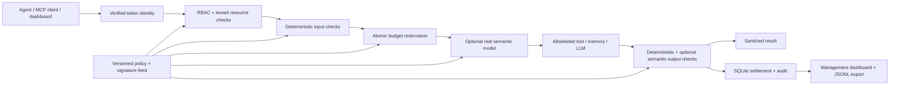

# FastFence

**Fast agents. Clear boundaries.** A working AI Control Layer for HackYeah 2026 / Goldman Sachs.

FastFence sits between an agent and business tools, tenant memory, or an allowlisted local LLM.
It verifies a provisioned identity, applies centralized policy, reserves a budget before invoking
the upstream, inspects the result, and records a sanitized decision. The dashboard lets judges
try requests, change policy, inspect consumption, and export audit records.

Business tools are **simulated**. The gateway controls, HTTP/MCP authentication, database,
policy reload, resource limits, and input/output filtering are real. The default policy runs
**deterministic controls only**. Hybrid mode uses a real separately hosted Ollama or Kev model;
there is no pretend classifier or fabricated semantic score in the application.

## Run

Requirements: macOS or Linux, Python 3.12–3.13, and [uv](https://docs.astral.sh/uv/).
The repository includes `uv.lock` and selects Python 3.13.

```sh
uv sync --locked --extra dev
uv run fastfence init
uv run fastfence serve
```

Open **http://127.0.0.1:8000**. In **Connect identities**, paste the `analyst-blue` and
`security-admin` values from `state/demo-tokens.json`. They are randomly generated locally,
stored with private permissions, and ignored by Git. Dashboard tokens stay in page memory.
There is no public default password. Management credentials cannot execute agent tools.

In another terminal:

```sh
uv run fastfence demo
uv run pytest -q
uv run ruff check src tests/*.py
```

The demo proves a legitimate request, injection signature, sensitive input, RBAC denial,
cross-tenant memory denial, sensitive-output redaction, and authorized simulated payment
preparation. Repeated calls consume the real daily budget. The suite also proves budget
exhaustion and concurrent reservation safety without relying on a running model.

## Architecture



The `core` package holds identity, schemas, controls, policy, and the decision pipeline;
`data/ledger.py` owns atomic durable accounting; `actions/tools.py` supplies the small
simulated backend; `adapters` integrates FastMCP and model servers; `app.py` serves HTTP and
the dashboard. This is intentionally a small project rather than a new general framework.

## Central configuration

`config/policy.yaml` is the single active policy source. It controls tool/model allowlists,
per-role permissions, daily per-subject budgets, input/output privacy behavior, signature
enforcement, semantic provider and risk threshold, size limits, and upstream timeouts.

The management dashboard edits the complete policy and increments its version. Save validates
the policy and feed before replacing the active snapshot. An invocation keeps its original
policy/feed versions even while configuration changes. Invalid candidates preserve the last
good active configuration. Changing files directly requires a higher policy version and
**Reload local files** or authenticated `POST /api/admin/reload`.

To demonstrate a less strict privacy policy, change `privacy.input` from `block` to `redact`;
the useful request proceeds with detected sensitive strings replaced. Set `privacy.output`
to `block` to suppress a sensitive result. Output blocking cannot roll back an action that
already ran; the verdict explicitly includes `upstream_executed`.

Provisioned identity claims live in the private `state/identities.json` file, outside client
requests. Client-provided role/tenant fields do not grant authority. Headers such as `X-Role`
and `X-Tenant` are ignored. Role grants cannot authorize a tool omitted from the active policy.
Tenant memory uses a validated `tenant/key` resource and must match the verified tenant.

## Real hybrid mode

Install/start [Ollama](https://docs.ollama.com/) and an appropriate model on your own hardware.
The example profile selects Qwen3:4b. No model weights or inference service are bundled.

```sh
ollama pull qwen3:4b
```

Stop the gateway, back up your policy, then activate the example:

```sh
cp config/policy.yaml config/policy.backup.yaml
cp config/policy.hybrid.yaml config/policy.yaml
uv run fastfence serve
uv run fastfence demo
```

If you have already raised the active policy version, set the copied profile's version to a
higher value before hot-reloading it. The dashboard can also change `semantic.provider` to
`ollama`, `semantic.model` to an installed model, and its timeout/threshold without a restart.

The Ollama adapter uses `/api/chat`, a constrained JSON score, `think: false`, temperature zero,
and a maximum of 256 completion tokens. Both input and output are scanned by default.
Invalid scores, provider errors, model unavailability and timeouts fail closed. A disabled
scanner is labeled disabled; it is never automatically substituted for a configured model.

**A model score is not a calibrated security probability.** Small general language models can
miss adversarial prompts and overblock benign discussion. Evaluate the chosen model, prompt,
and threshold before claiming detection quality. Deterministic authorization and budgets remain
enforced regardless of what the model decides. See `evaluation/` for independent synthetic
probes and the complete real-model results, including failures.

For [Kev](https://github.com/jaredpalmer/kev), separately run its official inference server,
set `semantic.provider: kev`, `semantic.model: kev-latest`, and configure the trusted server
address through `FASTFENCE_KEV_URL` (default `http://127.0.0.1:8009`). The adapter sends a
`/v1/systemone` `noul` security question and validates its returned score. Kev is not installed
or benchmarked as part of the default app. Never expose a model server directly to untrusted
users. `FASTFENCE_OLLAMA_URL` defaults to `http://127.0.0.1:11434`; callers cannot choose an
upstream URL or provide upstream credentials.

`POST /api/models/complete` provides an actual, non-streaming Ollama completion path with an
allowlisted model and role. Requested output tokens are clamped to the model's policy maximum.
The same input/output controls, timeouts, budget reservations and audit apply.

## Budget semantics

- Limits are scoped to a **trusted subject and UTC day**, so inventing session IDs cannot
  reset them. Limits cover calls, conservative token units, estimated cost, metered runtime,
  and concurrent invocations. Calls are charged when reserved, including subsequent failures.
- SQLite `BEGIN IMMEDIATE` atomically reserves the worst permitted allocation before model/tool
  execution. Parallel requests cannot each spend the same remainder. Settlement releases unused
  allocation; failed/cancelled/oversized operations retain conservative charges.
- Token units use a conservative UTF-8 byte estimate for tool I/O and model input, bounded model
  output tokens, and conservative envelopes for security scans. They are **not a provider billing
  statement** or an exact tokenizer count. Actual reported usage is checked against reservations.
- `cost_microusd` is a **configured per-call tariff estimate**: one micro-USD is $0.000001. It can
  model a commercial API's upper-bound call charge, while local inference can use zero cost and
  a compute budget. This MVP does not query commercial providers or reconcile their invoices.
- Runtime reserves the configured upstream/scan timeout allocations and settles measured time
  bounded by those allocations. Daily counters persist across restart. Unsettled crash reservations
  remain fully charged rather than refunding unverified work.
- This implementation supports **one gateway process per state directory**. A process-level file
  lock prevents unsafe multi-worker recovery. SQLite serializes concurrent requests inside that
  gateway; this is not a distributed ledger. For horizontal scale, replace it with a shared
  transactional ledger and lease-aware recovery.

## Signature feed and privacy scope

`config/signatures.json` is a bounded, validated feed of literal signatures. An external system
can update it on disk; reload requires a non-decreasing feed version and a higher policy version.
The examples cover Python pickle reducer/deserialization markers, an unsafe PyTorch loading
option, a remote-shell marker, and a common instruction-override phrase. Detection normalizes
Unicode NFKC and case. These demonstrate feed-driven mitigation of specific patterns associated
with historical attack classes; **they do not prevent all code execution, deserialization,
supply-chain attacks, encoded attacks, or prompt injection**.

Privacy detection covers API-key patterns, secret assignments, sensitive dictionary keys,
private-key blocks, email addresses, and string/numeric 11-digit Polish-ID candidates. Nested
objects, lists, dictionary keys and strings are inspected. Numeric/identifier patterns are
heuristics and can have false positives; there is no universal PII recognizer here. Audits never
store prompts, arguments, outputs, bearer credentials, resource names, or raw provider errors.
The API masks validation error bodies instead of echoing invalid user input. FastMCP applies
controls before creating both structured and text response representations.

## Integrate

The HTTP API's interactive schema is available at `/docs`.

| Endpoint | Credential | Purpose |
| --- | --- | --- |
| `POST /api/invoke` | Agent | `{ "tool": "knowledge.search", "arguments": { "query": "Quarterly forecast" } }` |
| `POST /api/models/complete` | Agent | `{ "model": "qwen3:4b", "prompt": "Summarize this report", "max_output_tokens": 64 }` |
| `GET /api/me` | Either | Show verified server-side identity |
| `GET /api/admin/status` | Management | Policy, signatures, telemetry, budgets, sanitized audit |
| `PUT /api/admin/policy` | Management | Validate, save and activate a higher-version policy |
| `POST /api/admin/reload` | Management | Reload policy and feed from local files |
| `GET /api/admin/audit.jsonl` | Management | Latest 10,000 sanitized events for SIEM ingestion |
| `/mcp/` | Agent | Streamable HTTP MCP tool and resource entry point |

Every authenticated invocation returns a request ID, decision/reason, policy and feed versions,
findings, timing, conservative consumption estimate, semantic status/score when evaluated,
whether upstream execution was attempted, and a filtered result. Administrative policy changes
also create sanitized audit entries. FastFence does not expose an audit modification/deletion API.

FastMCP example:

```python
import asyncio
import json
from pathlib import Path
from fastmcp import Client
from fastmcp.client.auth import BearerAuth

async def main():
    token = json.loads(Path("state/demo-tokens.json").read_text())["analyst-blue"]
    async with Client("http://127.0.0.1:8000/mcp/", auth=BearerAuth(token)) as client:
        result = await client.call_tool("invoke", {
            "tool": "knowledge.search", "arguments": {"query": "Quarterly forecast"}
        })
        print(result.data)
        print(await client.read_resource("memory://blue/forecast"))

asyncio.run(main())
```

The current adapter is a controlled server with explicit registered operations, not an
unrestricted arbitrary-MCP proxy. To integrate a real backend, implement the allowlisted
business handlers in `actions/tools.py` and keep upstream credentials on the gateway side.
The gateway cannot undo business side effects; irreversible operations need an independent
transaction/approval design appropriate to their domain.

## Validation and dependencies

The executable tests include positive/negative privacy cases, RBAC and header impersonation,
cross-tenant resources, invalid policy retention and live feed changes, snapshot version binding,
every budget type, parallel reservation races, timeout/error fail-closed behavior, private audit
exports, actual model request wire contracts with explicitly labeled test doubles, and authenticated
MCP HTTP tools/resources. Live inference quality is assessed separately in `evaluation/` so
passing unit tests cannot be confused with a model's accuracy.

Dependencies are resolved in `uv.lock`: FastAPI (MIT), FastMCP (Apache-2.0), Pydantic (MIT),
HTTPX (BSD-3-Clause), Uvicorn (BSD-3-Clause), PyYAML (MIT); development tools pytest and Ruff.
The project uses their public interfaces and does not vendor Laya, Kev or FastSprout code.
The supplied FastSprout tree informed organization only. FastCRUD and Bubus are unnecessary
for this small control pipeline; security decisions stay synchronous with execution rather than
depending on eventual event processing.
