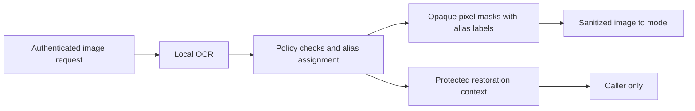

# Anonymization and OCR delivery plan

This page is a plan, not a list of released capabilities. Text pseudonymization,
context handling and Laya/UI integration are work in progress. The encrypted
client-carried context and OCR/image workflow below are not implemented.
Reversible replacement is pseudonymization: original values still exist in
protected restoration material.

## Module boundaries

| Component | Responsibility |
| --- | --- |
| `modules/ocr` | Extract ordered text, word offsets, bounding boxes and confidence locally; normalize image orientation and enforce processing limits. |
| `modules/anonymization` | Match configured patterns, issue stable aliases, protect restoration material and perform permitted restoration; render image masks using supplied regions. |
| `modules/control` | Enforce authentication, policy, budgets, hard blocks, semantic checks and safe audit metadata. |
| `workflows` | Connect public module facades, map text matches to image regions, and send only sanitized content upstream. |
| `shared` | Pydantic contracts for text spans, geometry, context and transformation results. |

Feature modules do not import one another. OCR does not decide policy, and the
ordinary text path does not load or execute OCR. Laya authors typed rules; local
runtime rules enforce the approved configuration.

## Delivery order and remaining work

1. **Finish text pseudonymization.** Complete input/output workflow integration,
   stable distinct aliases, default `ANONIM` prefixes, explicit restoration,
   ownership checks and rule revocation. Preserve original hard blocks and
   recheck transformed/restored content. Finish HTTP, MCP, OpenAI-compatible
   transport, isolated policy preview and Laya/UI tests.
2. **Settle the encrypted-context contract.** Decide who decrypts, specify a
   bounded client-carried capsule and select a reviewed authenticated encryption
   construction. Define key provisioning/rotation, expiry, owner binding and
   update ordering. Replace reliance on a process-local mapping only after
   tamper, expiry, restart and cross-owner tests pass.
3. **Build the independent OCR module.** Evaluate a local engine against
   synthetic Polish/English fixtures and check code/model licenses. Add typed
   spans, character offsets, dimensions, bounding boxes and confidence. Test
   orientation, multiword matches, limits, timeout and corrupt inputs. Keep
   blocking processing outside the request event loop.
4. **Build image masking.** Map full-text rule matches back to every affected
   region, replace pixels with opaque rectangles, render opaque alias labels and
   export a fresh image without source metadata. Use the same context aliases
   for equal values in text and images where policy permits. Keep restoration
   material outside the model request.
5. **Add image transport and demo.** Choose explicit upload/API contracts and
   a vision-capable upstream. The existing text-model demo alone does not prove
   image support. Show input sanitization first, then test the same controls on
   image outputs when the upstream actually returns images.
6. **Add optional pixel restoration.** Encrypt original crops and coordinates,
   bind them to the exact sanitized image and owner, handle overlapping regions,
   and restore only when requested and currently permitted. OCR text recovery
   alone does not reconstruct original pixels. Keep this after the first image
   demo unless the user selects it for initial scope.
7. **Verify and publish evidence.** Run architecture, typing, lint, transport and
   isolation checks. Evaluate OCR detection misses as well as successes. Measure
   text, capsule encryption/transfer, cold/warm OCR and image encoding separately;
   report p50/p95 and fixture coverage without claiming perfect detection.

## Proposed first image demo

- PNG/JPEG, printed Polish and English text, one image per request.
- Local OCR plus deterministic rules; opaque rectangles with labels such as
  `[EMAIL_1]` and optional recovery of the recognized text.
- PDF, handwriting, video and exact pixel restoration in later stages.
- Reject unsupported, oversized, failed or insufficient-quality processing
  according to explicit policy. OCR confidence cannot prove no sensitive text
  was missed; validation must measure those misses.

These are proposed defaults awaiting the scope decision, not commitments that
the capabilities already exist.

## Context and cryptography decisions

Short labels such as `[EMAIL_1]` require an inverse map. The proposed stateless
gateway carries that map in an authenticated encrypted capsule held by the
client. A hash is not restoration material, and a plain hash of predictable
personal data is unsuitable as a public region identifier.

Public-key encryption alone does not prove that FastFence issued a capsule.
The selected construction must authenticate the issuer and bind the capsule to
the verified owner and conversation. If only the client can decrypt, the
gateway cannot independently recover its mapping on the next request; that
choice requires a different client-side aliasing/restoration contract.

A stateless gateway cannot tell whether an otherwise valid capsule is the
latest one. Two parallel calls starting from the same mapping can allocate the
same numbered alias to different values. The proposed first implementation
serializes updates within one conversation at the client; different
conversations remain independent. Parallel branches need an explicit merge
design. Immediate per-capsule revocation and strict rollback prevention require
state; expiry alone does not provide them.

## Questions awaiting answers

1. **Key ownership:** does FastFence decrypt and restore after checking access,
   or must only the client possess the decryption key?
2. **Initial image scope:** accept the PNG/JPEG text-recovery demo above, or
   require exact pixel restoration or PDF in the first implementation?
3. **Conversation concurrency:** can the client serialize updates to one
   conversation, or must parallel tool calls share and merge context immediately?

OCR engine selection, bounded processing limits and the first synthetic test
corpus can be researched independently while these answers are pending.
