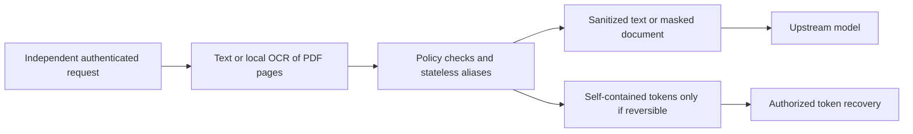

# Stateless anonymization and OCR delivery plan

This is a plan, not a list of released capabilities. Text transformations and
Laya/UI integration are work in progress. Stateless recovery tokens, OCR and PDF
processing are not implemented. The latest user decision supersedes the earlier
conversation vault and client-carried mapping capsule designs.

## Confirmed requirements

- No conversation database, server alias vault, conversation identifier,
  session affinity or client-carried conversation mapping.
- Independent parallel calls; no per-conversation queue.
- Policy selects irreversible masking or reversible pseudonymization.
- PNG/JPEG and multipage PDF belong to the first document release.
- Bounded local processing; measure total latency including model token overhead.

Static configured keys and active policy are runtime configuration, not
conversation state. Temporary request-local processing buffers are allowed.

## Two processing modes

These names describe the planned contract, not existing configuration fields.

| Mode | Output and recovery |
| --- | --- |
| `irreversible` | Sanitized content and opaque aliases only. Retain/export no original values, inverse maps, original crops or encrypted recovery payloads. Reject restoration. |
| `reversible` | Self-contained authenticated encrypted tokens, each carrying its own recoverable value. Restoration also requires explicit opt-in, verified ownership and current policy permission. |

Disabling output restoration does not destroy a reversible token's recovery
material. Switching policy to irreversible prevents gateway recovery under that
policy but cannot erase copies already held by clients. Reversible replacement
is pseudonymization. Removing detected values is not proof that all identifying
information has been removed from surrounding content.

## Stateless tokens

A short alias such as `[EMAIL_K7Q...]` uses a keyed fingerprint scoped to the
verified tenant, subject, rule and entity type. Equal values can have the same
identifier across independent calls, without sequential counters. This
intentionally reveals equality within the scope; do not correlate different
owners or expose plain hashes of guessable personal data.

A reversible token additionally carries the encrypted value, version, key ID and
necessary cryptographic metadata. Use a reviewed authenticated construction,
separate keys for identifiers and encryption, fresh nonces where required, owner
and purpose binding, strict size limits and current-policy checks. Public-key
encryption alone does not authenticate FastFence as issuer. Never derive a
reusable encryption nonce from the value to force deterministic ciphertext.

Gateway-held decryption keys are the working implementation assumption, supplied
through deployment configuration. Authenticated hybrid public-key encryption can
separate encryption and decryption roles if needed. Client-only decryption would
move recovery into the client; the confirmed mode choice does not require it.

The model can reason about types and repeated opaque identifiers without originals.
Automatic recovery from its response requires the **complete unmodified reversible
token**. A short alias, missing token or paraphrase cannot recover the original.
Never let the model invent missing values. Test exact token copying with the real
upstream model. Randomized encryption can produce different complete tokens for
one stable identifier; request-local reuse is allowed but no persistent cache is
required. Authenticate tokens before preserving them as previously processed data.

Long ciphertexts cost additional model tokens. Benchmark crypto, transport and
upstream inference together. There is no registry: valid tokens may be replayed
until expiry or applicable policy/key revocation. Do not claim single-use,
latest-version or individual immediate-revocation guarantees without state.

## Independent modules

| Component | Responsibility |
| --- | --- |
| `modules/ocr` | Local ordered text, offsets, page IDs, bounding boxes and confidence; normalized orientation and bounded rendering/OCR. |
| `modules/anonymization` | Pattern matching, scoped aliases, self-contained recovery tokens, pixel masking and authorized recovery without a conversation store. |
| `modules/control` | Authentication, central policy, hard blocks, budgets, semantic checks and safe audit metadata. |
| `workflows` | Connect public facades, map text matches to pixel regions and send sanitized content upstream. |
| `shared` | Pydantic text-span, geometry and transformation contracts. |

Feature modules do not import one another. OCR extracts content; central rules
decide what to mask or block. Laya authors typed rules. The ordinary text path
must not execute OCR or load image models.

## Delivery order and remaining work

1. **Replace the unshipped context design.** Remove the planned conversation ID,
   alias vault, mapping capsule and queue dependency from work in progress.
   Specify stateless tokens and modes before integration; preserve shipped controls.
2. **Finish text transformations.** Implement literal/pattern rules, distinct
   aliases with a default `ANONIM` prefix, input/output processing and optional
   authorized recovery. Preserve original hard blocks and recheck transformed or
   restored values. Finish Laya, isolated preview, HTTP, MCP and OpenAI-compatible
   integration against the stateless contract.
3. **Verify tokens.** Test tampering, ownership, rule revocation, expiry, key
   rotation, malformed/oversized input, parallel calls and restart with identical
   keys. Prove irreversible mode retains no recovery material. Test actual-model
   copying and measure ciphertext expansion.
4. **Build OCR and PDF rendering.** Evaluate local engines on synthetic printed
   Polish/English fixtures and check code/model licenses. Add full-text offsets,
   word geometry, page IDs and confidence. Include mixed scanned/digital
   multipage PDFs from the start. Enforce processing limits outside the event loop.
5. **Build masking.** Map multiword matches to every affected region, overwrite
   pixels and add opaque labels. Export fresh sanitized images and multipage
   raster PDFs. Equal values share scoped aliases across text and pages.
6. **Add document transport and demo.** Define authenticated bounded uploads and
   select a vision-capable upstream. Show multipage PDF input and sanitized PDF
   output. Cover output images when the upstream actually produces them; text
   completion alone does not demonstrate image support.
7. **Add optional pixel recovery later.** A complete self-contained recovery token
   must carry its own encrypted crop, coordinates and exact artifact binding.
   A short region label cannot restore pixels. If implemented, tokens accompany
   the document as explicit recovery data, never a hidden conversation mapping
   or server lookup. Text recovery does not imply exact image recovery.
8. **Publish evidence.** Verify architecture, quality, isolation and transport.
   Evaluate OCR misses and false masks; measure text, crypto, model token overhead,
   cold/warm OCR and page encoding separately, including p50/p95. No unmeasured
   performance or perfect-detection claims.

## Image and PDF contract

PNG/JPEG and multipage PDF are confirmed initial scope. Printed Polish/English
text is the working baseline; handwriting, video and exact pixel recovery remain
later stages. For reversible recognized-text recovery, the complete text tokens
must be carried in the document response and supplied to recovery; labels alone
are insufficient. No prior response is stored by FastFence.

Render every PDF page, OCR locally, mask affected pixels and assemble a new PDF
exclusively from sanitized rasters. Preserve page order and dimensions. Do not
copy source PDF text/OCR layers, objects, attachments, metadata, forms or scripts.
A rectangle drawn over original PDF text is insufficient. Initial output loses
searchable/selectable text, accessibility structure, interactive forms, links,
signatures and original vector representation; safe reconstruction is later work.

Set upload/output byte, page-count, per-page/aggregate pixel, render/OCR timeout
and concurrency limits. Reject encrypted/unsupported PDFs explicitly at first.
Any page failure rejects the whole document; never present partial processing as
fully sanitized. Keep originals, OCR text and recovery tokens out of audit/status.

Crop recovery restores canonical raster pixels at the chosen resolution, not the
original PDF bytes or structure. OCR confidence cannot prove every secret was
detected; test and document misses.

## Remaining implementation choices

No further product answer is required to continue this plan. Select the local
OCR engine, reviewed cryptographic format/library, processing limits and test
fixtures through implementation and measurement. Gateway-held keys, PL/EN printed
text and text recovery before exact pixel recovery are explicit working assumptions.
Stateless parallel calls, two policy modes and initial multipage PDF are confirmed.
