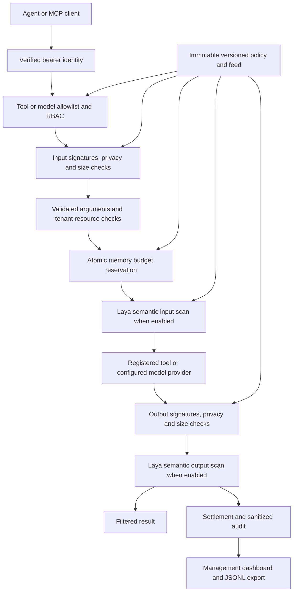

# Architecture

FastFence is a gateway between an authenticated agent and an allowlisted business tool, tenant resource, or local model. The enforcement pipeline is shared by the REST, OpenAI-compatible and MCP adapters. Business implementations are supplied through the tool port; the default product starts without business handlers. Runnable examples are separate from the runtime.

## Invocation pipeline

Requests denied during input checks never reach the upstream. Output-time blocking suppresses delivery after the upstream has already executed; it cannot undo a payment, write or other side effect. Verdicts expose `upstream_executed` so callers can distinguish these cases.

Each invocation keeps the policy and signature-feed versions acquired at its start. A concurrent reload affects subsequent invocations, while the original request continues under its captured snapshot.

## Package boundaries

The top-level dependency direction is `app → workflows → modules → shared`. The control feature follows `interfaces → application → persistence → contracts → domain`.

| Layer | Responsibility |
| --- | --- |
| `app` | Application factory, HTTP/CLI transports and lifecycle |
| `workflows` | Cross-feature orchestration for stateless anonymization and model content |
| `modules/control/interfaces` | Authenticated MCP tool and resource transport |
| `modules/control/application` | Invocation services, management use cases and composition facade |
| `modules/control/persistence` | Concrete memory accounting, identity/configuration, model, secret-detector and tool adapters |
| `modules/control/contracts` | Narrow ports used by the application services |
| `modules/control/domain` | Pydantic policy models, limits, privacy rules and signature checks |
| `shared` | Common Pydantic model and environment-backed settings |

The `persistence` package name identifies an implementation boundary; the runtime ledger stores nothing durably. Application services depend on ports. The facade composes concrete adapters, and the application factory composes the transports. Domain code has no HTTP, MCP or database dependency. Import-linter checks these boundaries.

All first-party records use Pydantic. Policy models are frozen; role/signature collections use tuples and rule mappings are immutable. Acquiring the active policy/feed snapshot returns an existing reference in O(1).

## Configuration outside enforcement

A background worker reads a trusted local policy/feed pair or one HTTP JSON bundle. It bounds reads, validates the complete candidate, checks version/content consistency and atomically publishes the immutable snapshot. Changed policy and feed content require their respective versions to increase. Invalid updates and source outages retain the last good snapshot; startup requires a valid source.

Configuration parsing, fingerprinting and I/O stay outside invocation enforcement. The deterministic path uses local rules and memory counters. An approved upstream call or an explicitly enabled semantic model can perform network I/O.

Provisioned bearer-token hashes and their subject, tenant, role and management claims are loaded from trusted startup configuration. Request fields and role/tenant headers cannot change those claims. Management credentials cannot invoke agent tools.

## Resource accounting

Before execution, a process-local lock atomically reserves calls, conservative token units, configured cost estimates, compute-time allocation and concurrency. Settlement releases unused allocation. The concurrency check also includes requests that started on the previous UTC day.

Limits apply to **one instance, one trusted subject and one UTC day**. Restart resets all budgets and telemetry. Separate instances have separate allowances; this implementation provides no coordinated global spending cap. A shared cap requires external coordination or consistent subject routing.

Token units combine conservative UTF-8 estimates, bounded completion tokens and scan envelopes. Model reservations also allow 1,024 token units for provider prompt-template overhead; unused capacity is released, and larger reported usage still fails closed. They are not exact provider token counts. `cost_microusd` is a trusted per-call tariff estimate, not an invoice. Compute time is settled within the reserved timeout allocation.

## Privacy and detection

The privacy pipeline combines existing secret/PII heuristics with an offline detect-secrets adapter. It applies active input/output `block` or `redact` settings to nested keys, values, lists and strings, then checks size again after redaction.

Nineteen credential-format/keyword detectors are constructed at startup. Runtime uses their local string analysis without credential verification, repository baselines, filesystem scans or per-request global settings changes. Findings contain detector names rather than secret values. Detector failures block delivery with a sanitized reason.

Scalar line-wrap reconstruction is limited to 4,096 characters and eight line breaks. Fragments distributed across fields or messages are not reconstructed. Entropy-only plugins are excluded from the runtime profile. Literal signatures, PII heuristics and semantic models can miss attacks or produce false positives; this is not universal DLP or prompt-injection prevention.

## Observability

Audit records omit prompts, arguments, outputs, bearer credentials and raw provider errors. A bounded memory ring retains 10,000 records by default. Aggregate decision counters continue after older records are evicted; the latency sample is bounded to 2,048 observations. Status exposes rolling throughput, p95 latency, scan attempts, configuration health and per-instance budget consumption.

Trusted call sites explicitly classify invocation and management events. Caller-selected tool names cannot hide denied invocations from request metrics. Retained records can be exported through the authenticated management API; restart clears them.
