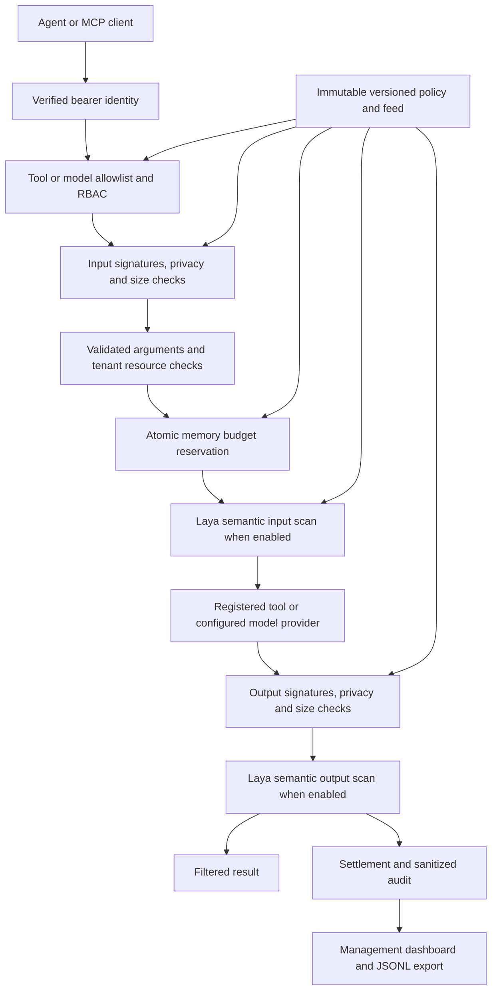

# Architektura

FastFence jest bramką pomiędzy uwierzytelnionym agentem a dozwolonym narzędziem biznesowym, zasobem tenanta lub skonfigurowanym modelem. Adaptery REST, zgodny z OpenAI, MCP i ACP współdzielą proces kontroli. Implementacje biznesowe są dostarczane przez port narzędzi; domyślny produkt uruchamia się bez nich. Działające przykłady są oddzielone od środowiska produktu.

## Przebieg wywołania

Żądania odrzucone podczas kontroli wejścia nie docierają do usługi docelowej. Blokada wyjścia wstrzymuje dostarczenie wyniku już po wykonaniu operacji; nie może cofnąć płatności, zapisu ani innego skutku ubocznego. Pole `upstream_executed` pozwala odróżnić te sytuacje.

Każde wywołanie zachowuje wersje polityki i zestawu sygnatur pobrane na początku. Równoległe przeładowanie wpływa na kolejne wywołania, podczas gdy rozpoczęte żądanie kontynuuje pracę ze swoim snapshotem.

## Konfiguracja poza ścieżką kontroli

Proces w tle odczytuje zaufaną lokalną parę polityka/sygnatury lub jeden pakiet JSON przez HTTP. Ogranicza odczyt, waliduje kompletną propozycję, sprawdza zgodność wersji z treścią i atomowo publikuje niezmienny snapshot. Zmieniona treść polityki i sygnatur wymaga podniesienia odpowiedniej wersji. Błędne aktualizacje i awarie źródła zachowują ostatni poprawny snapshot; start wymaga poprawnego źródła.

Parsowanie konfiguracji, obliczanie jej odcisków i I/O odbywają się poza ścieżką kontroli wywołań. Część deterministyczna korzysta z reguł lokalnych i liczników w pamięci. Zatwierdzone wywołanie docelowe lub skonfigurowany model oceniający mogą korzystać z sieci.

Skróty tokenów bearer oraz powiązane tożsamości, tenanty, role i uprawnienia administracyjne są wczytywane z zaufanej konfiguracji startowej. Pola żądania i nagłówki ról lub tenantów nie zmieniają tych uprawnień. Token administratora nie może wywoływać narzędzi agenta.

## Rozliczanie zasobów

Przed wykonaniem lokalna blokada procesu atomowo rezerwuje wywołania, zachowawcze jednostki tokenów, oszacowany koszt, czas obliczeń i współbieżność. Rozliczenie zwalnia niewykorzystaną rezerwację. Kontrola współbieżności obejmuje także żądania rozpoczęte poprzedniego dnia UTC.

Limity obowiązują dla **jednej instancji, jednej zaufanej tożsamości i jednego dnia UTC**. Restart zeruje budżety i telemetrię. Oddzielne instancje mają osobne limity; ta implementacja nie zapewnia wspólnego globalnego limitu wydatków. Wspólny limit wymaga zewnętrznej koordynacji lub stałego kierowania tożsamości do instancji.

Jednostki tokenów łączą zachowawcze oszacowania UTF-8, ograniczony rozmiar odpowiedzi i narzut skanowania. Rezerwacja modelu uwzględnia też 1024 jednostki na szablon promptu dostawcy. Niewykorzystany budżet jest zwalniany; większe raportowane zużycie nadal blokuje wynik. To nie jest dokładna liczba tokenów dostawcy. `cost_microusd` jest zaufaną stawką szacunkową za wywołanie, a nie fakturą. Czas obliczeń jest rozliczany w granicach zarezerwowanego czasu.

## Prywatność i wykrywanie

Kontrola prywatności łączy heurystyki sekretów i danych osobowych z adapterem detect-secrets działającym lokalnie. Stosuje ustawienia `block` lub `redact` dla wejścia i wyjścia do zagnieżdżonych kluczy, wartości, list i tekstów, a następnie ponownie sprawdza rozmiar po redakcji.

Dziewiętnaście detektorów formatów danych dostępu i słów kluczowych powstaje podczas startu. W trakcie żądań analizują wyłącznie lokalne teksty: bez weryfikacji danych dostępu, baz wyjątków repozytorium, skanowania plików ani globalnych zmian ustawień na każde żądanie. Wyniki zawierają nazwy detektorów zamiast sekretów. Błąd detektora blokuje wynik, podając bezpieczny opis przyczyny.

Odtwarzanie tekstu rozbitego na linie ograniczono do pojedynczej wartości o długości 4096 znaków i ośmiu podziałów wiersza. Fragmenty rozłożone między polami lub wiadomościami nie są łączone. Profil nie zawiera detektorów opartych wyłącznie na entropii. Sygnatury literalne, heurystyki PII i modele semantyczne mogą przeoczyć atak lub dać fałszywy alarm; nie jest to uniwersalny system DLP ani pełna ochrona przed prompt injection.

## Obserwowalność

Audyt pomija prompty, argumenty, odpowiedzi, tokeny dostępu i surowe błędy dostawcy. Ograniczony bufor w pamięci przechowuje domyślnie 10 000 rekordów. Zagregowane liczniki decyzji rosną także po usunięciu starszych rekordów; próbka opóźnień ma limit 2048 obserwacji. Status pokazuje bieżącą przepustowość, p95 opóźnienia, próby skanowania, stan konfiguracji i zużycie budżetu instancji.

Zaufane miejsca wywołań jawnie klasyfikują zdarzenia wykonania i zarządzania. Nazwa narzędzia wybrana przez klienta nie ukryje odrzuconego żądania przed metrykami. Zachowane rekordy można wyeksportować przez uwierzytelnione API administracyjne; restart je usuwa.
