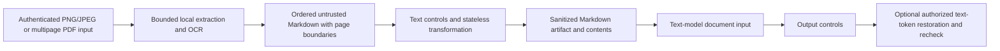

# Stateless anonymization and OCR delivery plan

Updated 2026-10-04: the accepted stateless text-token and OCR-to-Markdown design is implemented. This record preserves the design rationale and original delivery sequence; it is no longer an outstanding implementation plan. Current code supports irreversible aliases, authenticated symmetric FFR1 tokens, RSA-OAEP/AES-GCM FFR2 envelopes, explicit restoration, local image and multipage PDF OCR, and policy-checked Markdown.

Implementation and evidence are tracked in FF-042, FF-043, FF-047, FF-071, FF-095 and FF-098. The last two changes are part of the upcoming 1.0.1 release: restored plaintext receives semantic output reinspection, and document authorization plus one atomic budget reservation precede OCR. Independent focused verification passed 58 tests across document admission, Markdown, restoration, named rules and OCR. This is a scoped regression result, not a new model-accuracy or performance benchmark.

The current contract is summarized in [requirements](requirements.md); public setup is in the [anonymization example](../docs/examples/asymmetric-anonymization.md) and [manual verification](../docs/manual-testing.md). Conversation vaults, mapping capsules and per-conversation queues were superseded by the stateless design. Image/PDF editing and pixel recovery were explicitly removed from scope.

## Confirmed requirements

- No conversation database, server alias vault, conversation identifier,
  session affinity or client-carried conversation mapping.
- Independent parallel calls; no per-conversation queue.
- Policy selects irreversible masking or reversible pseudonymization.
- Printed Polish/English text in PNG/JPEG and multipage PDF belongs to the first
  document release.
- Local OCR produces Markdown that replaces the original document in the model
  request. Deliver the sanitized `.md` artifact and send its contents upstream.
- Bounded local processing; measure total latency including model token overhead.

Static configured keys and active policy are runtime configuration, not
conversation state. Temporary request-local processing buffers are allowed.

## Two processing modes

These are implemented values of `anonymization.mode`; recovery additionally requires active rule permission and explicit request consent.

| Mode | Output and recovery |
| --- | --- |
| `irreversible` | Sanitized Markdown/text and opaque aliases only. Retain/export no original values, inverse maps or encrypted recovery payloads. Reject restoration. |
| `reversible` | Self-contained authenticated encrypted text tokens, each carrying its own recoverable value. Restoration also requires explicit opt-in, verified ownership and current policy permission. |

Disabling output restoration does not destroy a reversible token's recovery
material. Switching policy to irreversible prevents gateway recovery under that
policy but cannot erase copies already held by clients. Reversible replacement
is pseudonymization. Removing detected values is not proof that all identifying
information has been removed from surrounding content.

## Document input becomes Markdown

Image and PDF editing are outside this scope: no pixel masking, modified PDF
export, image reconstruction or pixel restoration.

The document path accepts PNG/JPEG and multipage PDF. OCR and any necessary PDF
page rendering run locally, before a text-model request. Assemble the extracted
content as one ordered Markdown document, preserving explicit page boundaries
and page order. Digital and scanned PDF pages use the same downstream text
contract.

Run the extracted Markdown through the existing text controls and the selected
stateless transformation mode. Only after these checks pass, produce the sanitized
`.md` artifact and use the **same sanitized contents** as the model's document
input. Original image/PDF bytes and raw OCR text must never reach the upstream
model or audit logs. The ordinary text path must not execute OCR or load image
models.

Treat document Markdown as untrusted content. Keep it in the document/user-data
portion of the model request; never promote extracted headings, instructions or
embedded prompts into system instructions. Preserve hard blocks and check both
original extracted content and the transformed text, so replacing a sensitive
value cannot hide an attack from the remaining controls.

Markdown preserves text and page separation, rather than the original visual
layout. Reading order and tables are best effort and require evaluation on
representative documents. Do not claim exact table reconstruction, faithful page
layout or complete extraction from every document. Optional restoration applies
to text tokens and delivered text responses only.

## Stateless tokens

A short alias such as `[EMAIL_K7Q...]` uses a keyed fingerprint scoped to the
verified tenant, subject, rule and entity type. Equal values can have the same
identifier across independent calls, without sequential counters. This
intentionally reveals equality within the scope; do not correlate different
owners or expose plain hashes of guessable personal data. The configured default
alias prefix is `ANONIM`.

A reversible token additionally carries the encrypted text value, version, key
ID and necessary cryptographic metadata. Use a reviewed authenticated
construction, separate keys for identifiers and encryption, fresh nonces where
required, owner and purpose binding, strict size limits and current-policy checks.
Public-key encryption alone does not authenticate FastFence as issuer. Never
create a reusable encryption nonce from the value to force deterministic
ciphertext.

Gateway-held decryption keys are supplied through deployment configuration. The implemented FFR2 mode adds hybrid public-key encryption with a separate issuer MAC. The full gateway still requires the matching private key for security reinspection, even when response restoration is disabled. A public-only gateway or client-only recovery mode is not implemented.

The model can reason about types and repeated opaque identifiers without originals.
Automatic recovery from its response requires the **complete unmodified reversible
token**. A short alias, missing token or paraphrase cannot recover the original.
Never let the model invent missing values. Test exact token copying with the real
upstream model. Randomized encryption can produce different complete tokens for
one stable identifier; request-local reuse is allowed but no persistent cache is
required. Authenticate tokens before preserving them as previously processed data.

Long ciphertexts cost additional model tokens. Benchmark crypto, transport and
upstream inference together. There is no registry: valid tokens may be replayed
until expiry or applicable policy/key revocation. Do not claim single-use,
latest-version or individual immediate-revocation guarantees without state.

## Independent modules

| Component | Responsibility |
| --- | --- |
| `modules/ocr` | Local PL/EN extraction, page IDs, reading order, confidence and ordered Markdown production, with bounded PDF rendering/OCR. |
| `modules/anonymization` | Text matching, scoped aliases, self-contained encrypted text tokens and authorized text recovery without a conversation store. |
| `modules/control` | Authentication, central policy, hard blocks, budgets, semantic checks and safe audit metadata. |
| `workflows` | Connect public facades, pass OCR Markdown through text controls, deliver sanitized `.md` bytes and send the same contents to the model. |
| `shared` | Pydantic extraction, page-boundary, Markdown and text-transformation contracts. |

Feature modules do not import one another. OCR extracts content; central rules
decide what to mask or block. Laya authors typed rules. Transformation and output
restoration remain independently controlled by active policy and explicit request
consent.

## Original delivery sequence (implemented milestones)

1. **Replace the unshipped context design.** Remove the planned conversation ID,
   alias vault, mapping capsule and queue dependency from work in progress.
   Specify stateless tokens and modes before integration; preserve shipped controls.
2. **Finish text transformations.** Implement literal/pattern rules, distinct
   aliases with a default `ANONIM` prefix, input/output processing and optional
   authorized text recovery. Preserve original hard blocks and recheck transformed
   or restored values. Finish Laya, isolated preview, HTTP, MCP and OpenAI-compatible
   integration against the stateless contract.
3. **Verify tokens.** Test tampering, ownership, rule revocation, expiry, key
   rotation, malformed/oversized input, parallel calls and restart with identical
   keys. Prove irreversible mode retains no recovery material. Test actual-model
   copying and measure ciphertext expansion.
4. **Build local extraction.** Evaluate OCR engines on synthetic printed
   Polish/English PNG/JPEG and mixed scanned/digital multipage PDF fixtures. Check
   code/model licenses, preserve page order and boundaries, and produce Markdown.
   Evaluate accents, reading order, multiline values and tables without assuming
   OCR confidence proves complete detection. Run rendering/OCR outside the event loop.
5. **Add document transport and demo.** Define authenticated bounded uploads and
   a sanitized `.md` artifact response. Show a multipage PDF becoming Markdown,
   passing text controls and replacing the original document in the model request.
   Verify the upstream receives exactly the sanitized Markdown content.
6. **Publish evidence.** Verify architecture, quality, isolation and transport.
   Evaluate extraction misses, false matches and table/reading-order limitations.
   Measure text transformation, crypto, model token overhead, cold/warm OCR and
   multipage extraction separately, including p50/p95. No unmeasured performance
   or perfect-detection claims.

## Bounded document contract

Set upload byte, page-count, per-page/aggregate rendering pixel, extracted text,
sanitized Markdown byte, render/OCR timeout and concurrency limits. Reject
unsupported or encrypted PDFs explicitly in the first release. Any page failure
rejects the document; never present partially checked Markdown as a fully sanitized
artifact.

Keep processing request-local. Deliver sanitized `.md` bytes and content through
an authenticated response; do not use a conversation store to retain document
originals or recovery data. Use safe artifact names and metadata. Audit/status
records contain sanitized decisions and processing counts, never original files,
raw OCR text, Markdown bodies or recovery tokens.

Test the boundary directly: inspect the text-model request and confirm that it
contains the sanitized Markdown in page order, with no original file attachment
or unsanitized extracted text. Include document-borne prompt injections as
untrusted test content, and verify both blocked documents and benign near matches.

## Selected components and remaining measurement

The implementation uses local PaddleOCR with the pinned orientation, mobile detection and Latin recognition models, and cryptography primitives for authenticated AES-GCM tokens with optional RSA-3072 wrapping. Keys remain gateway-held; both modes, independent calls, initial multipage PDF support and Markdown substitution are implemented.

Broad OCR quality and default Laya-path load performance remain measurement work. `evaluation/results/ocr-local.json` covers five synthetic fixtures with fresh-worker p50 3165.57 ms and p95 3732.22 ms, excluding HTTP and model inference. It is not representative production accuracy or a latency SLA. The asymmetric crypto report measures crypto operations alone, not end-to-end model token overhead. Preserve these scopes when planning wider document and concurrent semantic evaluations.
